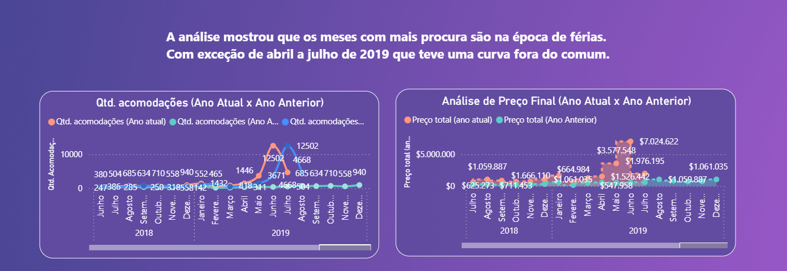

# Análise de Locação de Quarto Airbnb

# PROBLEMA DE NEGOCIO

O CEO e o Corpo Diretivo da Tudo Aqui identificaram o mercado de locação de quartos como próximo vetor de expansão do negócio. Antes de alocar capital nesse movimento, a liderança precisa de uma análise baseada em dados históricos do Airbnb em New York para responder se o mercado é viável, onde estão as melhores oportunidades e qual o perfil de produto com maior demanda — minimizando o risco da entrada em um setor novo.

# PREMISSAS DA ANÁLISE

 Foram utilizados dados históricos do Airbnb em New York de 2011 a 2019, com tratamento seguindo as regras de negócio definidas pelo CEO: apenas registros com todas as colunas preenchidas e padronização de campos de texto em maiúsculo. O relatório foi desenvolvido no Power BI com dois dashboards — análises gráficas e tabela de detalhes — e menu interativo com navegação entre as visões. 

# ESTRATEGIA DA SOLUÇAO

#### Passo 1: Definição da coluna fato e identificação das dimensões
#### Passo 2: Construção de tabela calendário para análise temporal
#### Passo 3: Análise por bairro — faturamento e volume de acomodações
#### Passo 4: Análise por tipo de quarto e padrão de acomodação
#### Passo 5: Desenvolvimento do relatório no Power BI seguindo os critérios do CEO

# HIPOTESES ANALISADAS

* Quais bairros geram maior faturamento e concentram mais acomodações?
* Qual a taxa de crescimento em faturamento e volume de acomodações?
* Existe sazonalidade relevante na demanda?
* Qual o tipo de quarto com maior procura?

# INSIGTHS DA ANALISE

### Manhattan e Brooklyn dominam — mas com perfis de rentabilidade distintos
Os dois bairros concentram o maior volume de acomodações com números similares entre si, mas Manhattan pratica preço médio significativamente mais alto. Para uma empresa entrando no setor, isso representa dois modelos de operação distintos: Manhattan entrega maior receita por unidade, com menor volume necessário para atingir metas de faturamento; Brooklyn entrega maior escala com ticket mais acessível, atraindo perfil de demanda mais amplo. A escolha entre os dois depende da estratégia de capital e do perfil de operação que a Tudo Aqui pretende adotar.
 
 

### O mercado está em expansão acelerada — com assimetria entre volume e receita
O crescimento comparado ao ano anterior é expressivo: +314% em quantidade de acomodações e +15% em faturamento. A assimetria entre os dois números é o dado mais estratégico da análise — o mercado cresce muito mais em oferta do que em receita, o que indica compressão de preço médio por acomodação. Entrar agora significa competir em um mercado em expansão, mas com crescente pressão sobre margem. Posicionamento e diferenciação de produto serão determinantes para sustentabilidade da operação.
 

### Sazonalidade é previsível — com uma anomalia que exige investigação
A demanda segue padrão sazonal consistente ao longo dos anos, com picos nos meses de férias. A exceção foi o período de abril a julho de 2019, que registrou curva fora do padrão histórico — crescimento acima do esperado que ainda não tem causa identificada nos dados disponíveis. Antes de usar 2019 como referência de projeção, é necessário entender se essa anomalia foi pontual (evento específico) ou estrutural (mudança de comportamento do mercado).
 

### Quarto de baixo padrão é o produto de maior demanda — em todos os anos
O quarto de baixo padrão liderou a procura de forma consistente ao longo de toda a série histórica. No último ano analisado, acomodações de altíssimo padrão registraram queda em locações, enquanto o segmento de alto padrão manteve crescimento. O mercado sinaliza claramente onde está a demanda: volume está no segmento acessível, e crescimento sustentável está no padrão intermediário-alto — não no premium. 
 

# RESULTADO/ RECOMENDAÇÃO

A análise confirma a viabilidade da expansão, mas com três sinalizações estratégicas que devem orientar a entrada no mercado.

**O mercado cresce, mas a rentabilidade por unidade comprime:** O crescimento de 314% em volume contra apenas 15% em faturamento indica que a oferta está se expandindo mais rápido do que a demanda consegue absorver com preços estáveis. Entrar com volume alto e preço competitivo em bairros de alta demanda — Manhattan e Brooklyn — é a estratégia com menor risco de vacância e maior previsibilidade de receita.

**O produto certo está mapeado:** Quartos de baixo padrão dominam a demanda historicamente, e o segmento de alto padrão mantém crescimento mesmo com queda do altíssimo padrão. A recomendação é iniciar a operação com foco em quartos de baixo padrão para garantir ocupação, e desenvolver em paralelo oferta de alto padrão para capturar o segmento de maior ticket com crescimento sustentado.

**A sazonalidade é uma alavanca — não apenas um risco:** Com picos de demanda previsíveis nos meses de férias, é possível estruturar precificação dinâmica desde o início da operação: valores promocionais nas baixas temporadas para manter ocupação e preços otimizados nos períodos de pico para maximizar receita por unidade. A anomalia de abril a julho de 2019 precisa ser investigada antes de qualquer projeção de faturamento para os primeiros anos de operação.

# VISUALISE A ANALISE COMPLETA
https://app.powerbi.com/view?r=eyJrIjoiNTVhMDhhMzMtZmYyYS00MzRkLWExMDYtYmRlYjBkODk0YTI5IiwidCI6ImE0NTMyMzQyLWRjNjktNDhjMC1iODJhLTRhMWQ1ZDg2NGU2YiJ9

# Próximos Passos

* **Investigar a anomalia de 2019:** Identificar se o crescimento atípico de abril a julho de 2019 foi causado por evento específico — como grande evento na cidade ou mudança regulatória — ou por tendência estrutural de mercado, pois essa distinção impacta diretamente as projeções de receita do plano de expansão
* **Coletar dados de perfil de cliente:** Mapear o padrão de busca por tipo de quarto e região para identificar o perfil do cliente de maior LTV e orientar a segmentação de marketing desde a entrada no mercado
Estruturar modelo de precificação dinâmica: Desenvolver régua de preços por temporada para Manhattan e Brooklyn, maximizando receita nos picos de férias e sustentando ocupação nas baixas temporadas com valores promocionais
* **Estruturar modelo de precificação dinâmica:** Desenvolver régua de preços por temporada para Manhattan e Brooklyn, maximizando receita nos picos de férias e sustentando ocupação nas baixas temporadas com valores promocionais
* **Definir mix de entrada por bairro e padrão:** Com base na assimetria de crescimento entre volume e faturamento, simular cenários de portfólio — combinações de quartos por padrão e localização — para identificar o mix que equilibra ocupação, ticket médio e margem operacional antes do primeiro investimento