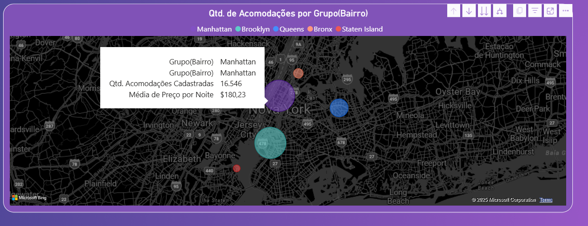

# Análise do Histórico do Airbnb

# PROBLEMA DE NEGOCIO
Analisar Históricos de dados do Airbnb para a empresa expandir para o setor de locação de quarto. 

# PREMISSAS DA ANÁLISE

 Foi solicitado pelo CEO que considere apenas as linhas que possuam todos os dados preenchidos em cada uma das colunas escolhidas como também colocar cada palavra em maiúsculo nos campos do tipo texto.
O CEO também deseja um menu interativo para acessar as análises com uma imagem que remeta a viagem de plano de fundo 

# CONTEXTO

A partir do trabalho que você tem realizado, o CEO e o Corpo Diretivo da Tudo Aqui (empresa fictícia) estão com planos de expandir a empresa de modo a abranger o ramo de locação de quartos. Neste cenário, você deverá desenvolver uma análise criteriosa em um novo relatório do Power BI com os dados de New York dos anos de 2011 a 2019 disponibilizados pelo Airbnb.

O CEO deseja um relatório com apenas 2 dashboards, sendo 1 com as análises gráficas e 1 com os detalhes (tabela ou matriz).

# ESTRATEGIA DA SOLUÇAO

#### Passo 1: Definição da coluna fato 
#### Passo 2: Identificação das dimensões
#### Passo 3: Montar uma tabela calendário para análise temporal 
#### Passo 4: Montar a análise por bairro
#### Passo 5: Montar a análise por quantidade de acomodações 
#### Passo 6: Montar um relatório no Power BI seguindo as regras de negocio da empresa com os critérios definidos pelo CEO

# HIPOTESES ANALISADAS

1. Quais bairro traz mais faturamento?
2. Quais bairro tem mais quantidade de acomodações ?
3. Qual a taxa de crescimento no faturamento?
4. Qual a taxa de crescimento da Quantidade de acomodação ?
5. Qual o Tipo de quarto mais procurado ?

# INSIGTHS DA ANALISE

### O bairro mais procurado é Manhattan e Brooklyn com quantidade de acomodações semelhantes, porem o preço médio é mais alto em Manhattan
 
 

### Comparado ao ano anterior tem um crescimento de 314% em relação a quantidade de acomodações e um crescimento de 15% em relação ao faturamento.
 

### A análise mostrou que os meses com mais procura são na época de férias. 
### Com exceção de abril a julho de 2019 que teve uma curva fora do comum.
 

### O quarto de baixo padrão foi o mais procurado em todos os anos 
 

# RESULTADO/ RECOMENDAÇÃO

O setor se mostrou em crescimento na região, sendo viável fazer campanhas de marketing direcionadas principalmente para quartos de baixo padrão em Manhattan e no Brooklyn nos meses de maior fluxo, e valores promocionais em baixas temporadas.
No ultimo ano houve uma queda na quantidade de locação de quartos de Altíssimo padrão. porem manteve um crescimento de Alto padrão.

# VISUALISE A ANALISE COMPLETA
https://app.powerbi.com/reportEmbed?reportId=2dd811f0-29fd-433b-ab21-40ae48aae247&autoAuth=true&ctid=58674b1f-122e-4f0b-989f-a1e1d8191402

# Próximos Passos

Fazer uma analise mais aprofundada na região para saber se houve algum evento especial pois o ano de 2019 tem um crescimento muito acima entre Abril a julho.
Coletar mais informações dos clientes para encontrar um padrão na busca pelo tipo de quarto e região.
